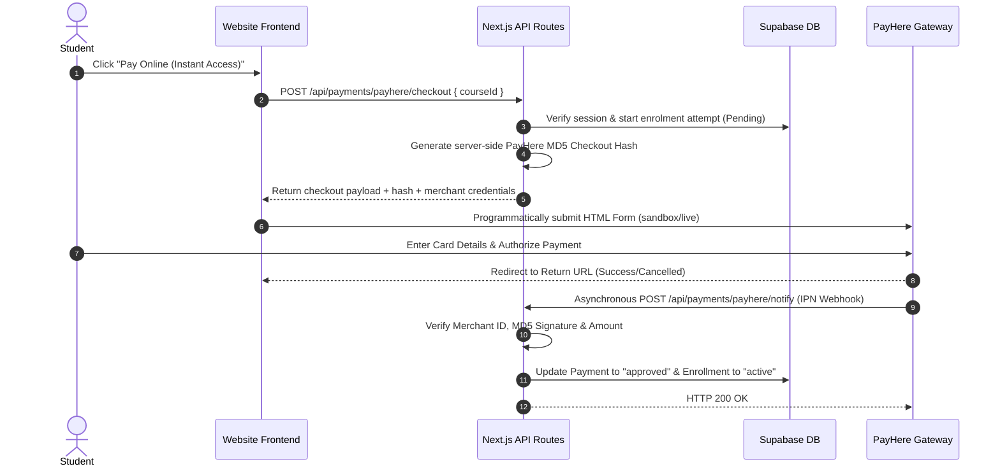

# PayHere Payment Gateway Integration Guide

This document provides complete documentation for the PayHere payment gateway integration in this platform. It is designed for developers, system integrators, and third-party developers who need to understand the architecture, API endpoints, cryptographic security checksums, database workflows, or integrate cross-domain payments.

---

## Table of Contents
1. [Architecture Overview](#1-architecture-overview)
2. [Environment Configuration](#2-environment-configuration)
3. [Cryptographic Security & Hashing Formulas](#3-cryptographic-security--hashing-formulas)
4. [API Endpoints Reference](#4-api-endpoints-reference)
   - [POST /api/payments/payhere/checkout](#post-apipaymentspayherecheckout)
   - [POST /api/payments/payhere/notify](#post-apipaymentspayherenotify)
5. [Database & State Workflow](#5-database--state-workflow)
6. [Cross-Domain / External Integration Guide](#6-cross-domain--external-integration-guide)
7. [PayHere Test Cards & Verification](#7-payhere-test-cards--verification)

---

## 1. Architecture Overview

The integration follows a secure, server-verified checkout and Instant Payment Notification (IPN) callback flow:



### Key Security Design Principles
- **No Client Secrets**: The `PAYHERE_MERCHANT_SECRET` is stored strictly on the server and is **never** exposed to the browser or frontend.
- **Server-Derived Hash**: Checkout hashes and redirect URLs are created on the server to prevent tamper attacks on payment amounts.
- **Timing-Safe & Amount Reconciled IPN**: The webhook validates signature hashes using `crypto.timingSafeEqual`, verifies the `merchant_id`, verifies exact `LKR` currency amounts against the database record, and processes callbacks idempotently.

---

## 2. Environment Configuration

To enable PayHere payments, ensure the following variables are defined in your `.env.local` file:

```ini
# PayHere Merchant Credentials
NEXT_PUBLIC_PAYHERE_MERCHANT_ID=your_payhere_merchant_id
PAYHERE_MERCHANT_SECRET=your_payhere_merchant_secret

# Sandbox Toggling (true for testing, false for live production)
NEXT_PUBLIC_PAYHERE_IS_SANDBOX=true

# Canonical Site URL (Used for generating return_url, cancel_url, and notify_url)
NEXT_PUBLIC_SITE_URL=https://yourdomain.com
```

---

## 3. Cryptographic Security & Hashing Formulas

PayHere relies on **MD5 hashing** to verify data integrity.

### 3.1 Checkout Hash Formula (Server-to-PayHere)
Generated in `/api/payments/payhere/checkout`:

$$\text{hashed\_secret} = \text{UPPERCASE}(\text{MD5}(\text{PAYHERE\_MERCHANT\_SECRET}))$$

$$\text{hash\_string} = \text{merchant\_id} + \text{order\_id} + \text{formatted\_amount} + \text{currency} + \text{hashed\_secret}$$

$$\text{final\_hash} = \text{UPPERCASE}(\text{MD5}(\text{hash\_string}))$$

* **Parameters**:
  - `formatted_amount`: Amount formatted to 2 decimal places (e.g. `"2500.00"`).
  - `currency`: Currency code (e.g. `"LKR"`).
  - Output must be in **UPPERCASE hex**.

### 3.2 IPN Signature Verification Formula (PayHere-to-Server)
Validated in `/api/payments/payhere/notify`:

$$\text{hashed\_secret} = \text{UPPERCASE}(\text{MD5}(\text{PAYHERE\_MERCHANT\_SECRET}))$$

$$\text{signature\_string} = \text{merchant\_id} + \text{order\_id} + \text{payhere\_amount} + \text{payhere\_currency} + \text{status\_code} + \text{hashed\_secret}$$

$$\text{computed\_sig} = \text{UPPERCASE}(\text{MD5}(\text{signature\_string}))$$

* **Validation Rule**:
  - Compare `computed_sig` against `md5sig` received from PayHere using timing-safe string comparison (`crypto.timingSafeEqual`).

---

## 4. API Endpoints Reference

### POST `/api/payments/payhere/checkout`

Initializes a payment attempt for an authenticated student.

* **Authentication**: Required (Supabase Auth Session Cookie)
* **Request Body** (`application/json`):
  ```json
  {
    "courseId": "uuid-of-the-class-module"
  }
  ```
* **Response Output** (`200 OK`):
  ```json
  {
    "success": true,
    "sandbox": true,
    "merchantId": "121XXXX",
    "orderId": "payment-uuid-1234",
    "returnUrl": "https://yourdomain.com/student/payment/return?payment=payment-uuid-1234",
    "cancelUrl": "https://yourdomain.com/student/payment/return?payment=payment-uuid-1234&cancelled=1",
    "notifyUrl": "https://yourdomain.com/api/payments/payhere/notify",
    "amount": "2500.00",
    "currency": "LKR",
    "hash": "9F8D7E6C5B4A...",
    "items": "Physics 2026 Revision",
    "customer": {
      "firstName": "Kamal",
      "lastName": "Perera",
      "email": "kamal@example.com",
      "phone": "0771234567",
      "address": "No 1, Main Road",
      "city": "Colombo",
      "country": "Sri Lanka"
    },
    "custom1": "user-uuid-5678",
    "custom2": "course-uuid-9012"
  }
  ```

---

### POST `/api/payments/payhere/notify`

Public Webhook listener registered as PayHere Instant Payment Notification (IPN) `notify_url`.

* **Authentication**: None (Public webhook verified via MD5 signature hash)
* **Content-Type**: `application/x-www-form-urlencoded`
* **Incoming Payload from PayHere**:
  | Field Name | Type | Description |
  | :--- | :--- | :--- |
  | `merchant_id` | `string` | Merchant ID sending the notification |
  | `order_id` | `string` | Unique Payment ID generated by our server |
  | `payment_id` | `string` | PayHere's transaction reference ID |
  | `payhere_amount` | `string` | Total amount charged (e.g. `"2500.00"`) |
  | `payhere_currency` | `string` | Currency code (`"LKR"`) |
  | `status_code` | `string` | PayHere payment status (`"2"` = Success) |
  | `md5sig` | `string` | PayHere generated signature checksum |
  | `custom_1` | `string` | Student User ID |
  | `custom_2` | `string` | Class Module ID |

* **PayHere Status Codes**:
  - `2` : Payment Successful
  - `0` : Pending
  - `-1` : Cancelled
  - `-2` : Failed
  - `-3` : Chargedback

* **Processing Verification Steps**:
  1. Verify `merchant_id === NEXT_PUBLIC_PAYHERE_MERCHANT_ID`.
  2. Compute local MD5 signature and compare with `md5sig` using `crypto.timingSafeEqual`.
  3. Lookup payment order in database by `order_id`.
  4. Verify `paidAmount === expectedAmount` and `payhereCurrency === 'LKR'`.
  5. Check if already `status === 'approved'` (Idempotency check).
  6. On status `2`: update payment status to `'approved'` and enrollment status to `'active'`.
  7. On status `-1`, `-2`, `-3`, or `0`: mark payment status as `'rejected'`.
  8. Return HTTP `200 OK` (`"OK"`).

---

## 5. Database & State Workflow

The database manages payments and enrollments across two tables:

### `public.payments`
| Column | Type | Details |
| :--- | :--- | :--- |
| `id` | `uuid` | Primary key (`order_id`) |
| `user_id` | `uuid` | FK to `auth.users` |
| `course_id` | `uuid` | FK to `public.courses` |
| `amount` | `numeric(10,2)` | Class price |
| `status` | `text` | `'pending'`, `'approved'`, `'rejected'` |
| `bank_slip_url` | `text` | Contains `"PayHere Ref: <payment_id>"` for PayHere |

### `public.enrollments`
| Column | Type | Details |
| :--- | :--- | :--- |
| `id` | `uuid` | Primary key |
| `user_id` | `uuid` | FK to `auth.users` |
| `course_id` | `uuid` | FK to `public.courses` |
| `payment_id` | `uuid` | FK to `public.payments` |
| `status` | `text` | `'pending'`, `'active'` |

---

## 6. Cross-Domain / External Integration Guide

If you are building an **External Domain / Website** and want users to initiate payments or pass parameters to this platform, follow one of the integration methods below:

### Method A: URL Query Parameter Redirection (Deep Linking)
You can redirect a user from your external site to this website by passing the `courseId` and auto-checkout flags in the URL query string:

**URL Format:**
```text
https://thisdomain.com/student/courses/[COURSE_ID]?autoCheckout=1
```

**How it works:**
1. The student clicks a button on your external domain (`external-site.com`).
2. The user is redirected to `https://thisdomain.com/student/courses/[COURSE_ID]?autoCheckout=1`.
3. If the user is logged in, the frontend detects `autoCheckout=1` and automatically triggers the `/api/payments/payhere/checkout` flow.
4. If the user is not logged in, they complete registration/login and are redirected back to complete checkout.

---

### Method B: Cross-Domain API Parameter Transfer (Server-to-Server)
If your external domain needs to pass custom metadata or initiate a checkout session directly, you can make a cross-domain API request.

#### Sample Node.js / Express snippet for External Domain:
```javascript
// External Domain (e.g. external-lms.com)
const fetch = require('node-fetch');

async function initiateCrossDomainPayment(studentToken, classModuleId) {
  const TARGET_DOMAIN = 'https://thisdomain.com';

  const response = await fetch(`${TARGET_DOMAIN}/api/payments/payhere/checkout`, {
    method: 'POST',
    headers: {
      'Content-Type': 'application/json',
      'Cookie': `sb-access-token=${studentToken}` // Pass authentication cookie or auth header
    },
    body: JSON.stringify({
      courseId: classModuleId
    })
  });

  const data = await response.json();
  if (!response.ok) {
    throw new Error(data.error || 'Payment initiation failed');
  }

  // Construct HTML Checkout Form and submit to PayHere
  const payhereGatewayUrl = data.sandbox
    ? 'https://sandbox.payhere.lk/pay/checkout'
    : 'https://www.payhere.lk/pay/checkout';

  return {
    gatewayUrl: payhereGatewayUrl,
    checkoutParams: data
  };
}
```

---

## 7. PayHere Test Cards & Verification

When `NEXT_PUBLIC_PAYHERE_IS_SANDBOX=true`, use the following official PayHere test cards to verify checkout flows:

| Card Type | Card Number | CVV | Expiry Date |
| :--- | :--- | :--- | :--- |
| **Visa (Success)** | `4111 1111 1111 1111` | `123` | Any Future Date (e.g. `12/28`) |
| **MasterCard (Success)** | `5105 1051 0510 5105` | `123` | Any Future Date (e.g. `12/28`) |

---

*Documentation prepared for I SEE ICT LMS platform. Maintain confidentiality of all Merchant Secret keys.*
